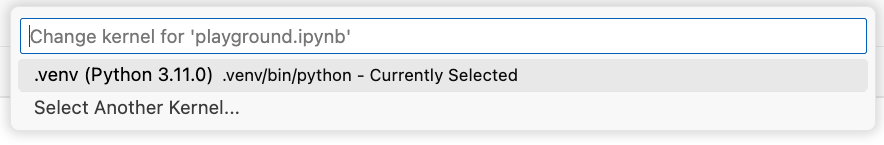

# Install Poetry

Poetry helps manage the python libraries used in this application. It can be installed on you system by following the instructions [here](https://python-poetry.org/docs/).

# Install necessary packets

Run the following command to install the necessary packets:

```bash
poetry install
```

# Opening the notebook

Now you can open the notebook and execute the code. If you open it in vs code you will be asked to select which kernel to use. Select the one that was created by poetry.


